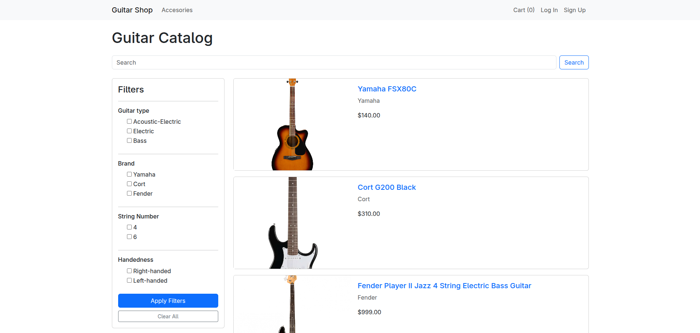
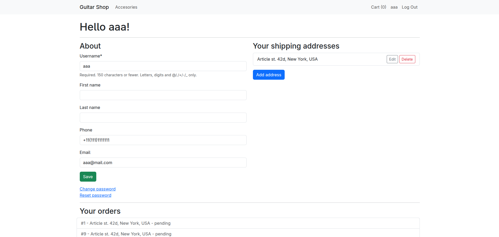
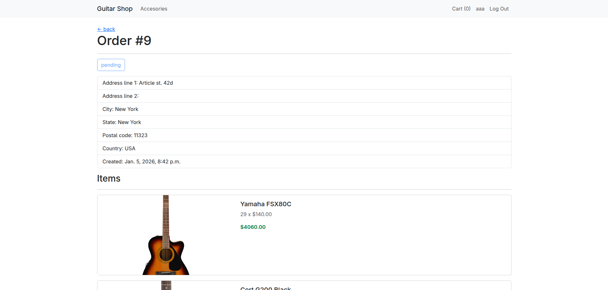
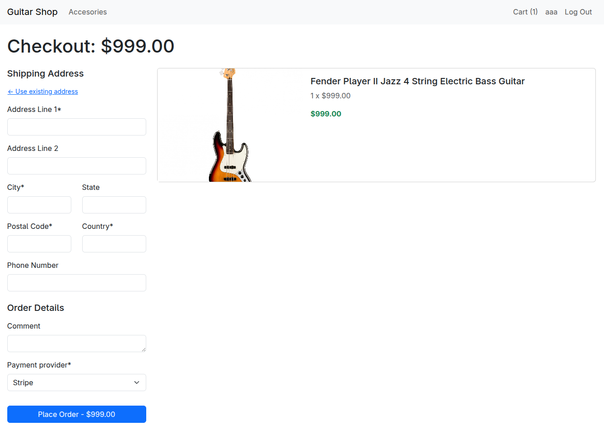
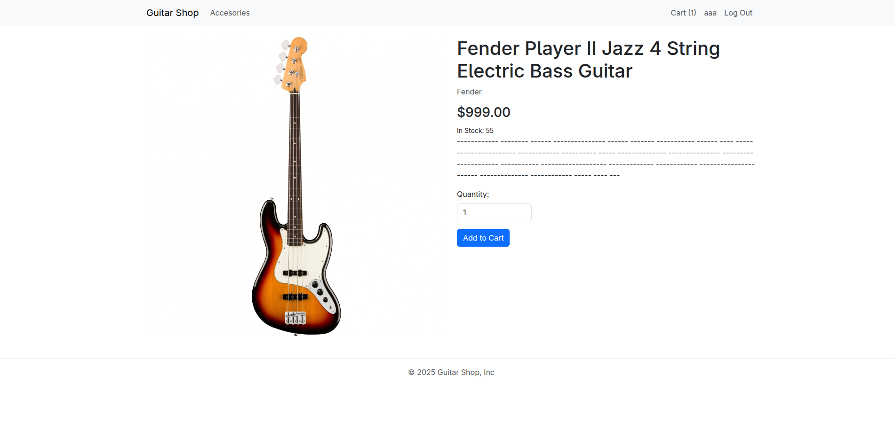

# Guitar Shop



E-commerce site built with Django, designed for selling guitars and musical accessories. This project demonstrates a fully functional shop with real-time payments, inventory management, and filtering system.

## Key Features


- Site splitted in two main categories: Guitars and Accessories.
- Advanced filtering options for users to easily find products based on brand, type, price range, etc.
- Session-based shopping cart for adding/removing items before checkout.
- Secure payment processing using Stripe Checkout.
- User account management with shipping address storage.
- Advanced shipping options.
- Real-time inventory updates to reflect stock availability.
- Order history and tracking for users.

## Technologies Used

- **Backend**: Python, Django 6.0
- **Database**: SQLite (Default) / Customizable
- **Payments**: Stripe API
- **Frontend**: Bootstrap 5, Crispy Forms
- **Utilities**: Pillow (Image processing), Django Filter

## Quick Start

### Prerequisites
*   Python 3.10+
*   Stripe Account (for API keys)

### Installation

1.  **Clone the repository**
    ```bash
    git clone https://github.com/yourusername/python-django-guitar-shop.git
    cd python-django-guitar-shop
    ```

2.  **Install dependencies**
    ```bash
    pip install -r requirements.txt
    ```

3.  **Configure Environment**
    Create a `.env` file in the root directory and add your Stripe keys:
    ```env
    STRIPE_PUBLIC_KEY=your_public_key
    STRIPE_SECRET_KEY=your_secret_key
    ```
    *(Note: See `base/settings.py` for other configuration options)*

4.  **Run Migrations & Server**
    ```bash
    python manage.py migrate
    python manage.py runserver
    ```

    Visit `http://127.0.0.1:8000` to browse the shop!

## Screenshots


### Home & Best Sellers


### User Dashboard


### Order details


### Checkout Process


### Product detail Page


